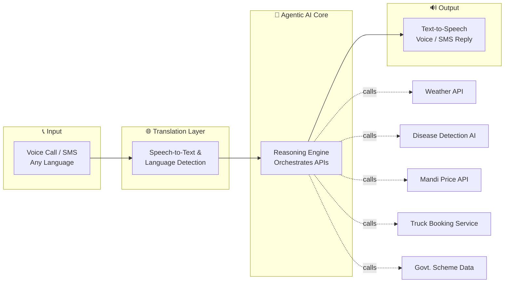
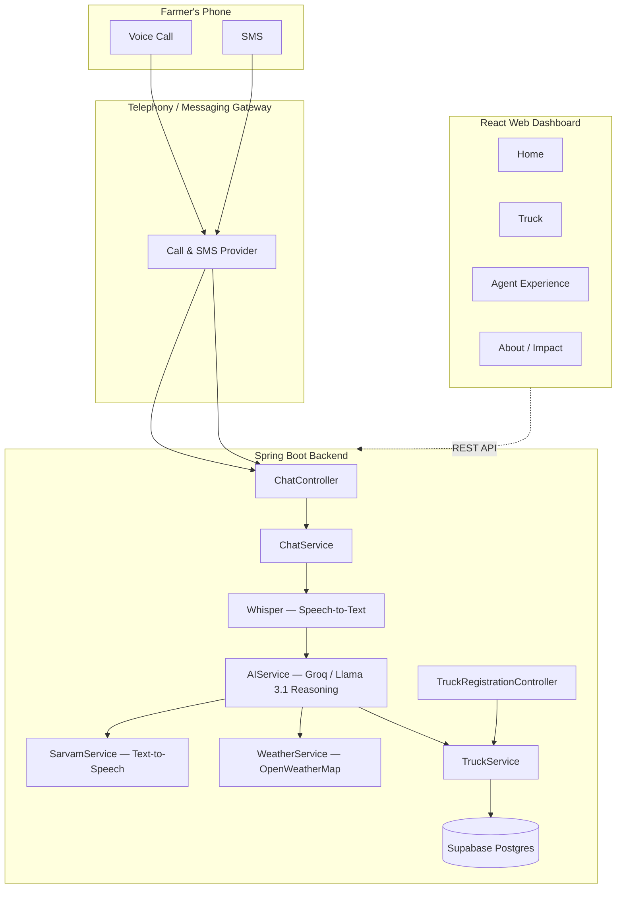
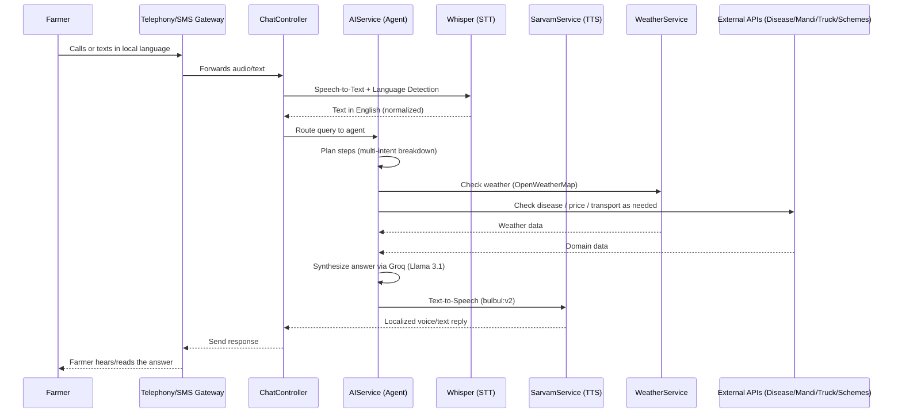

# 📵 Offline AI — Agentic AI Farming Assistant for Every Phone

**No App. No Internet. No Smartphone Required.**

> *"If every farmer can make a phone call, every farmer deserves AI."*

Offline AI brings agentic, multilingual, AI-powered farming assistance to **any phone** — feature phone or smartphone — over a simple **voice call or SMS**. No app to install, no data plan, no literacy barrier.

Built by **Team CodeGirl** for [ScriptedBy{Her} 2.0].

  🌐 Live: [Offline-AI](https://offline-ai-frontend.onrender.com/)

---
## 📸 Demo


## 📑 Table of Contents

- [The Problem](#-the-problem)
- [Our Solution](#-our-solution)
- [Why Agentic AI, Not a Chatbot](#-why-agentic-ai-not-a-chatbot)
- [System Architecture](#-system-architecture)
- [How a Query Flows Through the System](#-how-a-query-flows-through-the-system)
- [Tech Stack](#-tech-stack)
- [Project Structure](#-project-structure)
- [Getting Started](#-getting-started)
- [Environment Variables](#-environment-variables)
- [API Overview](#-api-overview)
- [Roadmap](#-roadmap)
- [Team](#-team)
- [License](#-license)

---

## 🚧 The Problem

AI has reached India's cities. It hasn't reached **Bharat**.

Farmers face massive information asymmetry around weather, crop disease, and market prices — yet almost every "Ag-Tech" solution assumes a smartphone and a stable internet connection.

| Stat | Meaning |
|---|---|
| **600M+** | Feature phone users in India |
| **65%** | Rural population without smartphone internet access |
| **22+** | Official languages creating a communication barrier |

## 💡 Our Solution

**One call or SMS. Unlimited intelligence.**

A farmer dials a number or sends an SMS in their own language and gets back a spoken (or texted) answer — powered by an agentic AI core that can plan, call multiple APIs, and reason across intents.

| Feature | What it does |
|---|---|
| 🌾 **Disease Detection** | Identify crop problems and get actionable expert advice instantly |
| ⛅ **Weather Forecast** | Real-time, hyper-local weather updates to plan harvesting |
| 💰 **Mandi Prices** | Live market prices across mandis to prevent middleman exploitation |
| 🚛 **Transport Booking** | Find and book trucks easily to prevent crop spoilage |
| 🏛️ **Govt. Schemes** | Discover and understand relevant agricultural subsidies |
| 🗣️ **Multilingual Voice** | Speak in your local language — the AI understands and replies naturally |

## 🤖 Why Agentic AI, Not a Chatbot

**Query:** *"My tomato leaves turned yellow. Will it rain? Should I spray pesticide?"*

| Traditional Chatbot | Offline AI Agent |
|---|---|
| Answers only one intent at a time | Understands multiple intents in a single query |
| No planning or decision-making logic | Plans a sequence of actions (check weather → check disease → formulate advice) |
| Cannot coordinate multiple external APIs | Autonomously calls all required APIs |
| Returns generic, incomplete responses | Returns one synthesized, actionable response — in the farmer's own language |

## 🏗️ System Architecture



### High-level component view



## 🔄 How a Query Flows Through the System



## 🛠️ Tech Stack

| Layer | Technology |
|---|---|
| **Backend** | Java, Spring Boot |
| **Frontend** | React (Vite) |
| **Database** | PostgreSQL via [Supabase](https://supabase.com) |
| **LLM / Reasoning Engine** | [Groq API](https://groq.com) running Llama 3.1 (`llama-3.1-8b-instant`) — powers `AIService` |
| **Speech-to-Text** | Whisper |
| **Text-to-Speech** | [Sarvam AI](https://sarvam.ai) `bulbul:v2` model, `anushka` voice — Indian language voice replies via `SarvamService` |
| **Weather Data** | [OpenWeatherMap API](https://openweathermap.org/api) via `WeatherService` |
| **Build Tools** | Maven (backend), npm/Vite (frontend) |
| **Styling** | CSS (`index.css`), component-based architecture |


## 📁 Project Structure

```
offline-ai/
├── backend/                          # Spring Boot API
│   ├── src/main/java/com/ai/
│   │   ├── OfflineAiApplication.java # App entry point
│   │   ├── entity/
│   │   │   └── Truck.java
│   │   ├── repository/
│   │   │   └── TruckRepository.java
│   │   ├── config/
│   │   │   └── RestTemplateConfig.java
│   │   ├── controller/
│   │   │   ├── ChatController.java
│   │   │   └── TruckRegistrationController.java
│   │   ├── dto/
│   │   │   ├── ChatMessage.java
│   │   │   ├── ChatRequest.java
│   │   │   └── ChatResponse.java
│   │   └── service/
│   │       ├── AIService.java        # Agentic reasoning core
│   │       ├── ChatService.java
│   │       ├── SarvamService.java     # Multilingual voice/translation
│   │       ├── TruckService.java
│   │       └── WeatherService.java
│   ├── src/main/resources/
│   │   └── application.yml
│   ├── src/test/java/com/ai/
│   │   └── BackendApplicationTests.java
│   └── pom.xml
│
└── frontend/                         # React web dashboard
    ├── public/
    │   └── video.mp4
    ├── src/
    │   ├── App.jsx
    │   ├── main.jsx
    │   ├── index.css
    │   ├── components/
    │   │   ├── Navbar.jsx
    │   │   ├── Footer.jsx
    │   │   └── PhoneDemo.jsx
    │   ├── pages/
    │   │   ├── Home.jsx
    │   │   ├── Truck.jsx
    │   │   └── About-impact.jsx
    │   └── agent-experience/
    │       └── AgentExperiencePage.jsx
    ├── index.html
    ├── vite.config.js
    └── package.json
```

## 🚀 Getting Started

### Prerequisites

- Java 17+ and Maven (or use the included `mvnw` wrapper)
- Node.js 18+ and npm
- A database (update `application.yml` with your connection details)
- API keys for weather, Sarvam AI

### Backend Setup

```bash
cd backend
./mvnw clean install
./mvnw spring-boot:run
```

The API starts on `http://localhost:8080` by default (check `application.yml`).

### Frontend Setup

```bash
cd frontend
npm install
npm run dev
```

The dashboard starts on `http://localhost:5173` by default.

## 🔑 Environment Variables

**`application.yml` should hold placeholders only — never real keys.** Reference environment variables with Spring's `${VAR_NAME}` syntax so actual secrets live outside the repo (in your shell, a `.env` loaded by your IDE/run config, or your deployment platform's secrets manager):

```yaml
server:
  port: 8080

spring:
  datasource:
    url: ${DB_URL}            # e.g. jdbc:postgresql://<supabase-host>:1111/postgres?prepareThreshold=0
    username: ${DB_USERNAME}
    password: ${DB_PASSWORD}
  jpa:
    hibernate:
      ddl-auto: none
    properties:
      hibernate:
        dialect: org.hibernate.dialect.PostgreSQLDialect

groq:
  api-key: ${GROQ_API_KEY}
  model: llama-3.1-8b-instant

weather:
  api-key: ${OPENWEATHER_API_KEY}
  base-url: https://api.openweathermap.org/data/2.5

sarvam:
  api-key: ${SARVAM_API_KEY}
  speaker: anushka
  model: bulbul:v2
```

Then set the actual values as environment variables before running, e.g.:

```bash
export DB_URL="jdbc:postgresql://<your-supabase-host>:6543/postgres?prepareThreshold=0"
export DB_USERNAME="postgres.<your-project-ref>"
export DB_PASSWORD="<your-db-password>"
export GROQ_API_KEY="<your-groq-key>"
export OPENWEATHER_API_KEY="<your-openweathermap-key>"
export SARVAM_API_KEY="<your-sarvam-key>"
```

## 📡 API Overview

| Endpoint | Controller | Purpose |
|---|---|---|
| `POST /api/chat` | `ChatController` | Receives a voice/SMS-derived query, routes it through the agentic AI core, returns a synthesized reply |
| `POST /api/trucks/register` | `TruckRegistrationController` | Registers a truck for the transport booking feature |
| `GET /api/trucks` | `TruckRegistrationController` | Lists available trucks |


## 🗺️ Roadmap

**"Every Farmer. Every Village. Every Language. One AI."**

| Today | Next Phase | Future Vision |
|---|---|---|
| ✅ Live Prototype | 🔜 IVR Support | 🔮 Banking Services |
| ✅ AI Integration | 🔜 Offline Voice AI | 🔮 Drone Advisory |
| ✅ Multilingual Support | 🔜 Government API Integration | 🔮 Satellite Monitoring |
| ✅ Crop Advisory | 🔜 Personalized Recommendations | 🔮 AI-Powered Farm Planning |
| ✅ Weather & Market Prices | 🔜 Transport Marketplace | |

## 👥 Team CodeGirl


## 📄 License

This project is licensed under the [MIT License](LICENSE) — see the `LICENSE` file for details.

---

<p align="center"><i>Building Bharat's AI infrastructure for the last mile.</i></p>
